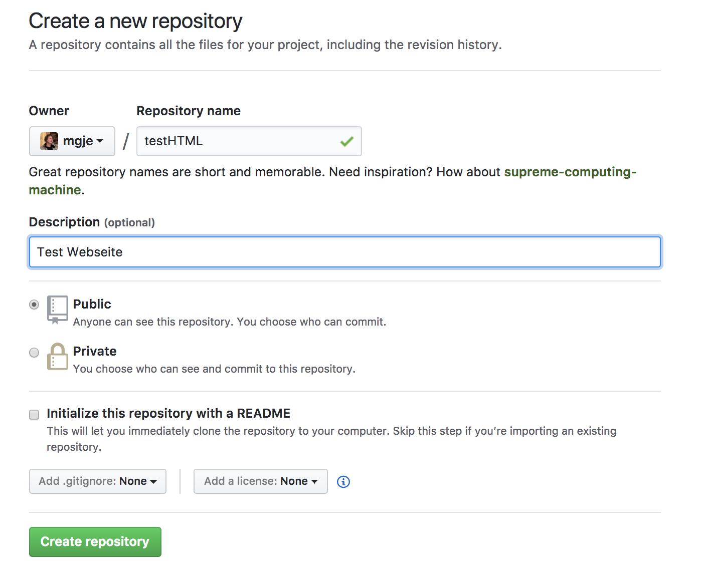
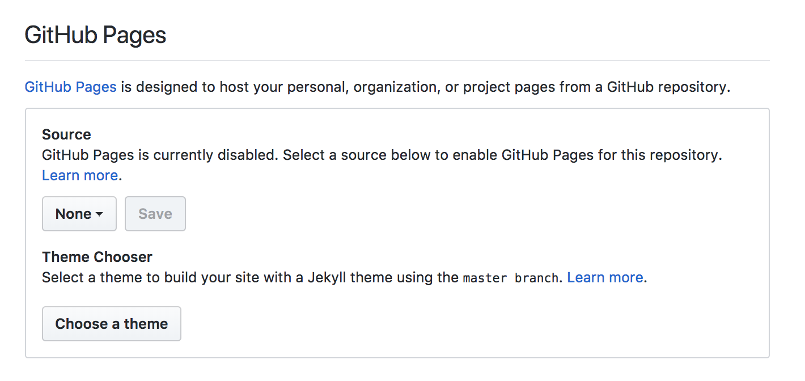
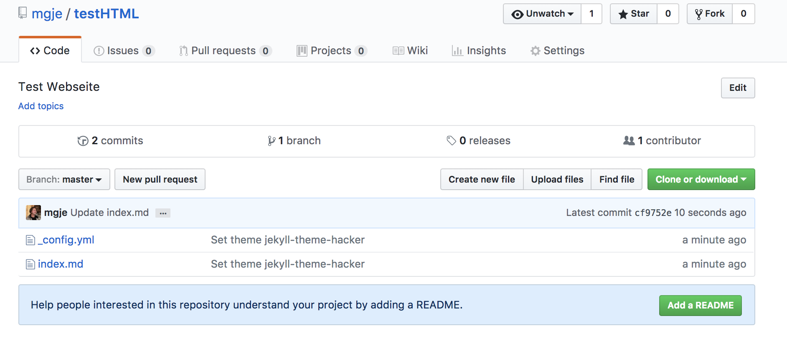
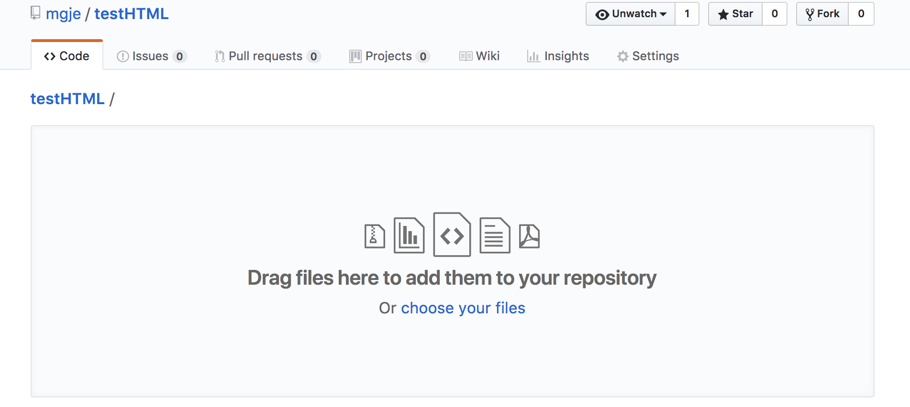
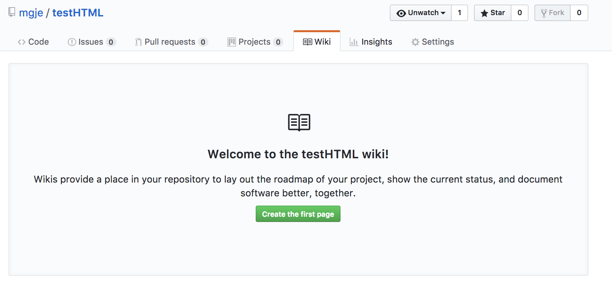

## Github Pages - Projektwebseite bei github.com erstellen


1. Account erstellen bei [github.com](https://gihub.com)


1. Repository (Projektordner) erstellen


1. gh-pages aktivieren durch die Auswahl eines *Theme* (Settings/gh-pages/, den Knopf ```Choose a theme``` drücken )


1. Damit ist die Webseite online, mit dem Knopf ```Add a README``` können Metainformationen und Erklärungen hinzugefügt werden



1. Orderner mit Bilder hochladen (Drag & Drop)


1. Die Bilder können in der Webseite im Wiki oder in Dateien (README.txt) mit relativen Pfaden verwendet werden, z.B. ```images/firstStep.png```

1. Github stellt verschiedene kollaborative Werkzeuge zur Verfügung, unter anderem auch ein Wiki



